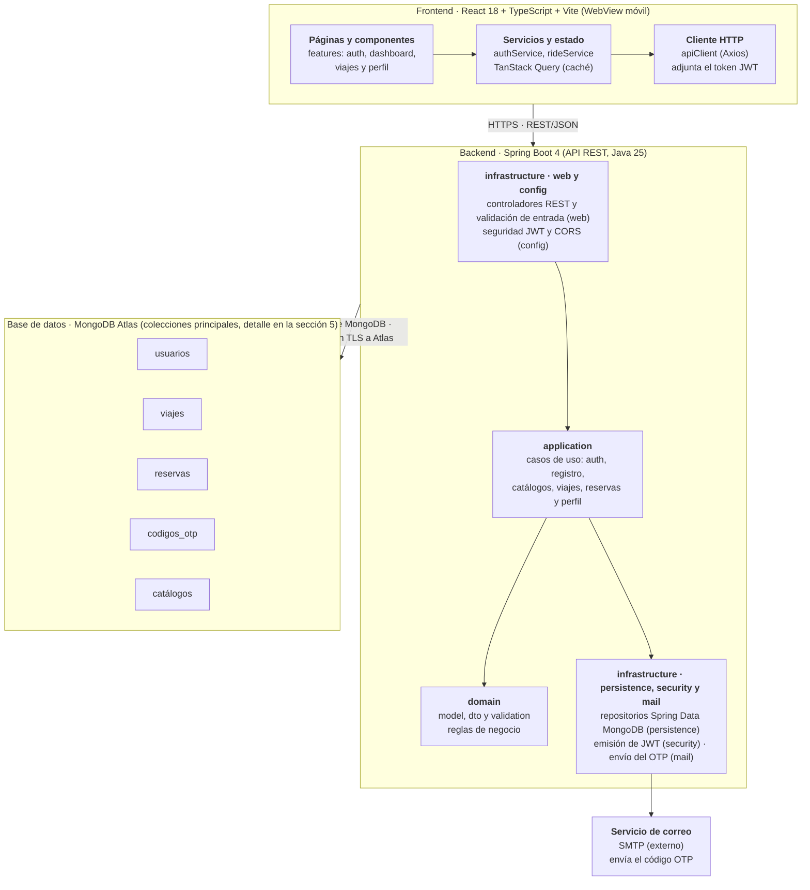
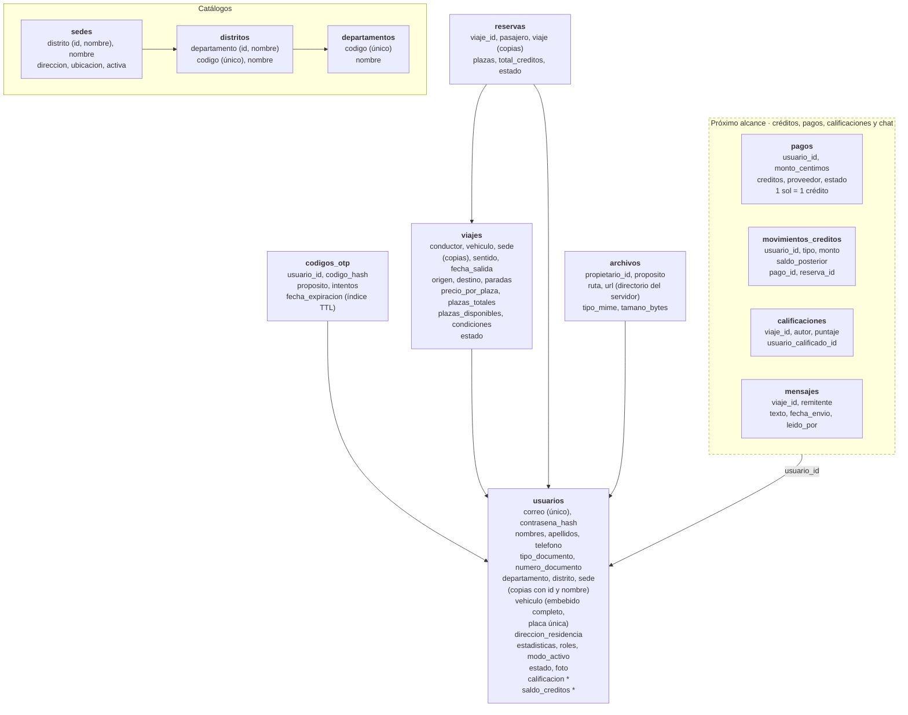
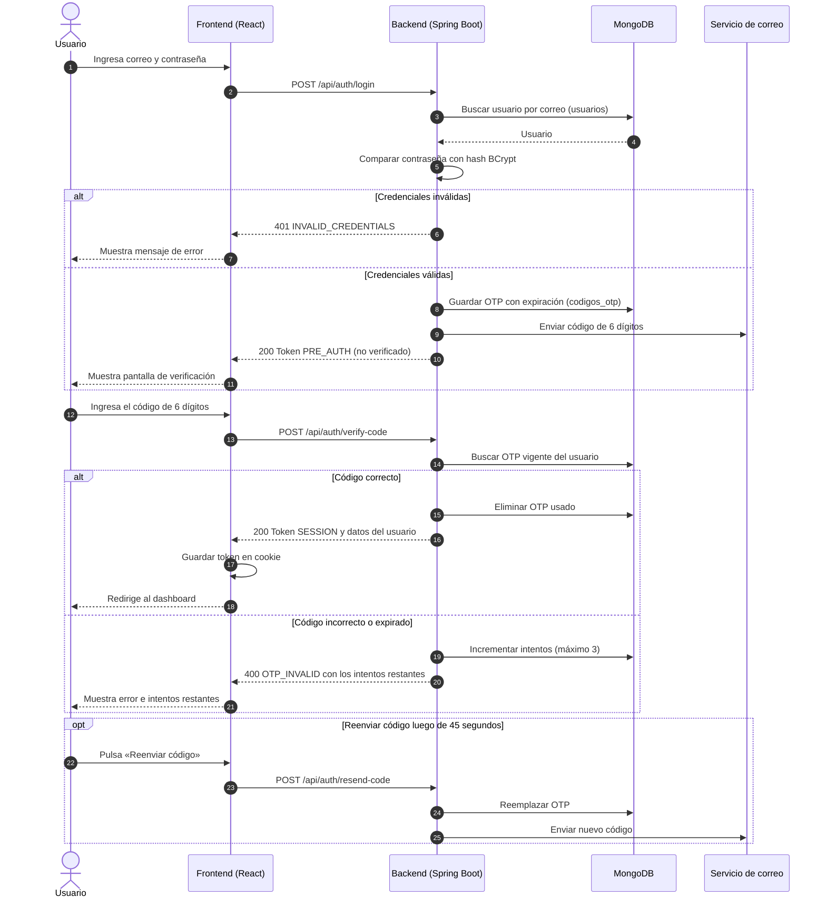
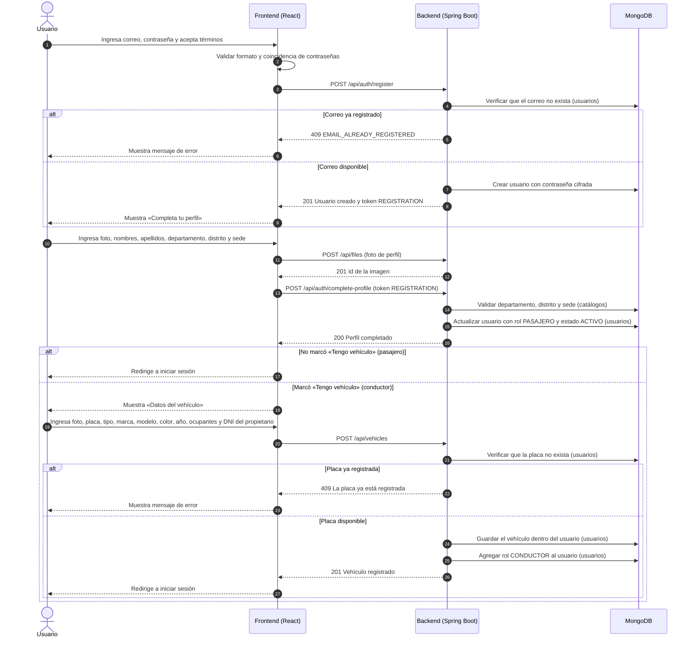
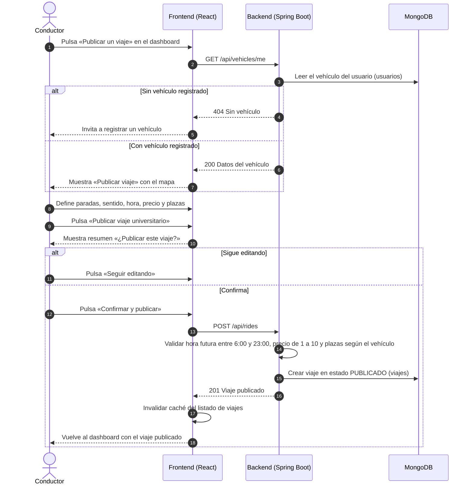
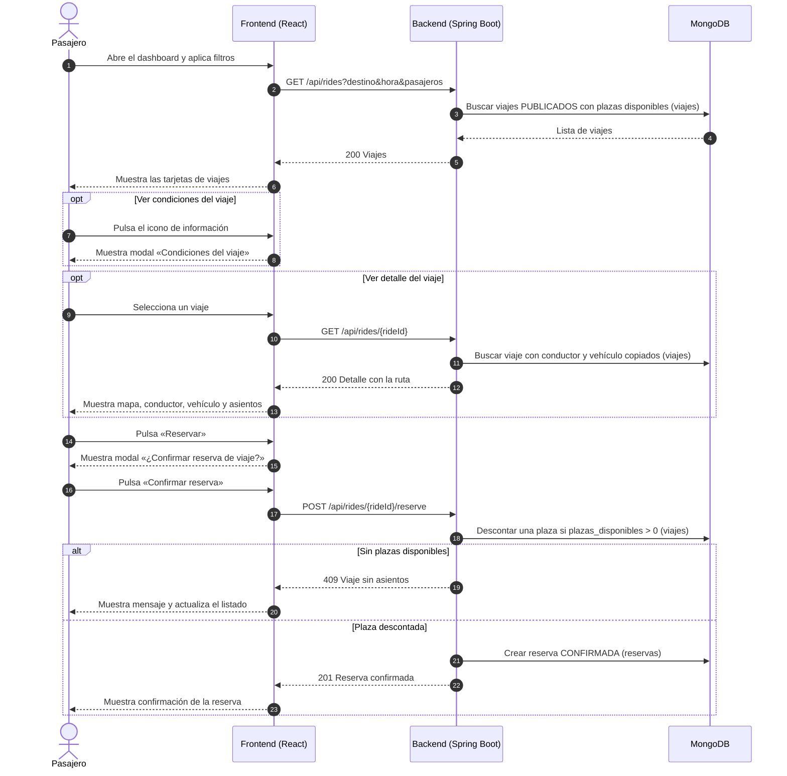
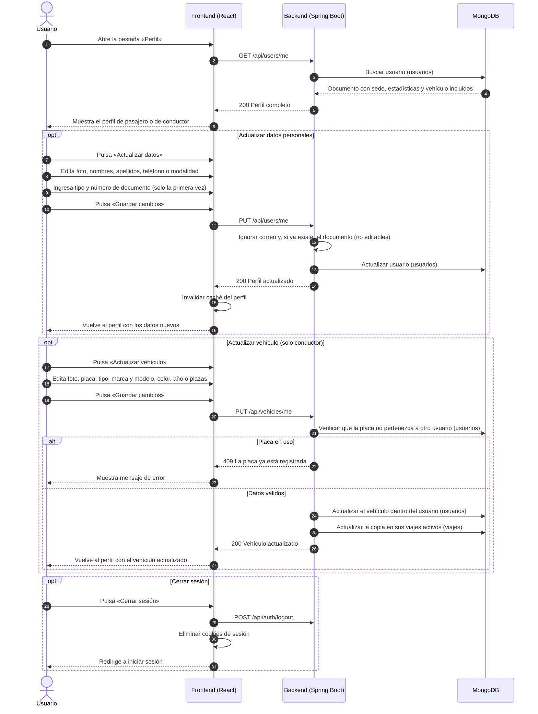

# ColaboraCar — Documento técnico y plan de trabajo

2026-10-08 · Manuel

## 1. Resumen y alcance

ColaboraCar es una aplicación de movilidad colaborativa para la comunidad de la UTP: los conductores publican viajes hacia o desde su sede y los pasajeros reservan asientos pagando un aporte en créditos. Este documento define los requerimientos, la arquitectura y los flujos principales, tomando como base los 16 mockups de `frames/` del repositorio.

| Elemento | Definición |
| --- | --- |
| Actores | **Pasajero**: busca y reserva viajes. **Conductor**: registra su vehículo y publica viajes. Un usuario puede alternar entre ambos roles (modo dual). |
| Frontend | React 18 + TypeScript + Vite + Tailwind CSS, incrustado en un WebView móvil. Mapas con Leaflet y OpenStreetMap. |
| Backend | API REST con Spring Boot 4 (Java 25), Spring Security, Spring Validation y Spring Data MongoDB. |
| Base de datos | MongoDB Atlas (NoSQL orientada a documentos, clúster administrado en la nube). |
| Módulos | Autenticación, registro, dashboard de viajes, reserva, publicación de viajes y perfil. |
| Fuera de alcance | Para un próximo alcance: créditos, pagos y billetera; y en mapas, el trazado de rutas por calles, la búsqueda de direcciones y el tráfico en tiempo real. Tampoco se incluyen historial de viajes, recuperación de contraseña, chat ni calificaciones. |

Estado actual: el backend (`app-movilidad-colaborativa-api/`) ya implementa la autenticación, el registro y los catálogos sobre MongoDB Atlas: 9 de los 19 endpoints del contrato (`docs/openapi.yaml`). Faltan la carga de imágenes, los vehículos, los viajes, las reservas y el perfil. El frontend implementa login, verificación OTP, registro, completar perfil y dashboard, todavía contra una API simulada con MSW. El detalle está en la sección 4.1.

## 2. Requerimientos funcionales (RF)

Son 22 requerimientos agrupados en seis módulos. En este alcance el aporte en créditos solo se muestra y se registra, sin cobro ni saldo: se refinará en un próximo alcance. La columna Pantalla indica el mockup de `frames/` que lo respalda.

| ID | Módulo | Requerimiento | Actor | Pantalla |
| --- | --- | --- | --- | --- |
| RF-01 | Autenticación | El sistema permite iniciar sesión con correo y contraseña. | Ambos | 01 |
| RF-02 | Autenticación | Tras el login, el sistema envía un código OTP de 6 dígitos al correo y exige validarlo antes de dar acceso. | Ambos | 02 |
| RF-03 | Autenticación | El sistema permite un máximo de 3 intentos de verificación y reenviar el código luego de 45 segundos. | Ambos | 02 |
| RF-04 | Autenticación | El usuario puede cerrar sesión desde el menú o desde su perfil. | Ambos | 13, 14 |
| RF-05 | Registro | El sistema permite crear una cuenta con correo, contraseña, confirmación de contraseña y aceptación de términos y condiciones. | Ambos | 03 |
| RF-06 | Registro | El usuario completa su perfil con foto, nombres, apellidos, departamento, distrito y sede universitaria. | Ambos | 04 |
| RF-07 | Registro | Si el usuario marca «Tengo vehículo», el sistema solicita los datos del vehículo y lo registra como conductor. | Conductor | 04, 05 |
| RF-08 | Registro | El registro del vehículo incluye foto, placa, tipo, marca, modelo, color, año de fabricación, cantidad de ocupantes y DNI del propietario, además de los checks «Soy el propietario» y de términos y condiciones. | Conductor | 05 |
| RF-09 | Dashboard | El sistema lista los viajes disponibles con aporte, vehículo, asientos libres, horario de salida y datos del conductor. | Pasajero | 06 |
| RF-10 | Dashboard | El usuario puede filtrar los viajes por destino, hora de salida y número de pasajeros. | Pasajero | 06 |
| RF-11 | Dashboard | El usuario puede consultar las condiciones que el conductor definió para un viaje. | Pasajero | 07 |
| RF-12 | Reserva | El usuario puede ver el detalle de un viaje: mapa con el punto de partida, las paradas y el destino unidos por líneas rectas, distancia en línea recta, duración estimada, vehículo y asientos disponibles. | Pasajero | 09 |
| RF-13 | Reserva | El sistema pide confirmar la reserva mostrando ruta, conductor y aporte total en créditos. | Pasajero | 08, 10 |
| RF-14 | Reserva | Al confirmar, el sistema registra la reserva y descuenta un asiento del viaje; si no quedan asientos, la rechaza. | Pasajero | 08, 10 |
| RF-15 | Publicación | El conductor define la ruta tocando el mapa para agregar o mover paradas; los puntos se unen con líneas rectas. | Conductor | 11 |
| RF-16 | Publicación | El conductor configura sentido del viaje (ida a la universidad o regreso a casa), hora de salida, precio por plaza y plazas disponibles. | Conductor | 11 |
| RF-17 | Publicación | El sistema muestra un resumen y pide confirmación antes de publicar; el viaje queda visible de inmediato en el dashboard. | Conductor | 12 |
| RF-18 | Publicación | Solo los usuarios con un vehículo registrado pueden publicar viajes. | Conductor | 06, 11 |
| RF-19 | Perfil | El usuario consulta su perfil: datos, estadísticas (viajes, cumplimiento —«Puntualidad» en el perfil del conductor—, ahorro de CO₂), sede, dirección de residencia y estado de cuenta. | Ambos | 13, 14 |
| RF-20 | Perfil | El usuario actualiza foto, nombres, apellidos y teléfono, y registra por única vez su tipo y número de documento de identidad; el correo institucional no es editable y el documento tampoco una vez guardado. | Ambos | 15 |
| RF-21 | Perfil | El usuario puede alternar su modalidad activa entre pasajero y conductor. | Ambos | 15 |
| RF-22 | Perfil | El conductor actualiza los datos de su vehículo: foto, placa, tipo, marca y modelo, color, año y plazas. | Conductor | 14, 16 |

### 2.1 Reglas de negocio (RN)

Son 16 reglas de validación agrupadas por pantalla. La columna Pantalla indica el mockup de `frames/` donde se aplica; las pantallas que no figuran no tienen reglas definidas todavía.

| ID | Pantalla | Regla |
| --- | --- | --- |
| RN-01 | 01 — Iniciar sesión | Solo se admiten correos del dominio `utp.edu.pe`. |
| RN-02 | 03 — Registro | Solo se permite registrarse con un correo del dominio `utp.edu.pe`. |
| RN-03 | 03 — Registro | La contraseña tiene al menos 8 caracteres y combina letras, números y símbolos. |
| RN-04 | 04 — Completar perfil | Todos los datos son obligatorios, incluida la foto, excepto el check «Tengo vehículo». |
| RN-05 | 04 — Completar perfil | Los nombres y los apellidos tienen como mínimo una letra. |
| RN-06 | 05 — Datos del vehículo | Todos los campos son obligatorios, excepto el check «Soy propietario» y la foto. |
| RN-07 | 05 y 16 — Vehículo | La placa respeta el formato de placas del Perú. |
| RN-08 | 05 y 16 — Vehículo | El año de fabricación es como mínimo 2000 y como máximo el año actual. |
| RN-09 | 05 y 16 — Vehículo | Los asientos son como mínimo 1 y como máximo 10. |
| RN-10 | 11 — Publicar viaje | Todos los campos son obligatorios. |
| RN-11 | 11 — Publicar viaje | Las plazas disponibles son como mínimo 1 y como máximo las plazas del vehículo. |
| RN-12 | 11 — Publicar viaje | Los horarios deben estar entre las 6:00 y las 23:00. |
| RN-13 | 11 — Publicar viaje | El monto por plaza es como mínimo S/ 1 y como máximo S/ 10 (1 sol = 1 crédito). |
| RN-14 | 15 — Actualizar datos | Todos los datos son obligatorios, incluida la foto. El tipo y el número de documento se ingresan una sola vez y luego no se pueden modificar; el teléfono sí. |
| RN-15 | 16 — Actualizar vehículo | Todos los datos son obligatorios, incluida la foto. |
| RN-16 | 16 — Actualizar vehículo | De los checks, solo es obligatorio el de términos y condiciones. |

## 3. Requerimientos no funcionales (RNF)

Son 10 requerimientos básicos, cada uno con un criterio verificable. Los valores numéricos son metas propuestas para el proyecto académico.

| ID | Categoría | Requerimiento |
| --- | --- | --- |
| RNF-01 | Seguridad | Las contraseñas se almacenan cifradas con BCrypt; nunca en texto plano. |
| RNF-02 | Seguridad | Los endpoints protegidos exigen un token JWT válido; la comunicación usa HTTPS. |
| RNF-03 | Seguridad | El código OTP expira a los 5 minutos y se invalida tras 3 intentos fallidos. |
| RNF-04 | Rendimiento | El 95 % de las peticiones a la API responde en menos de 2 segundos con 50 usuarios concurrentes. |
| RNF-05 | Usabilidad | La interfaz es responsiva para pantallas móviles desde 360 px de ancho y respeta las áreas seguras del WebView. |
| RNF-06 | Usabilidad | Los formularios validan los datos en el cliente y muestran mensajes de error en español. |
| RNF-07 | Disponibilidad | El sistema está disponible al menos el 99 % del tiempo en el horario académico (6:00 a 23:00). |
| RNF-08 | Mantenibilidad | El frontend se organiza por módulos de dominio (`features/`). El backend también se organiza por módulo (`auth`, `catalogs`, `files`, `users` y `shared`), y cada módulo tiene tres capas: application (casos de uso), domain (model, dto y reglas de negocio) e infrastructure (web, persistence, security y mail). |
| RNF-09 | Portabilidad | El frontend funciona en WebView de Android e iOS y en las dos últimas versiones de Chrome y Safari. |
| RNF-10 | Escalabilidad | La API no guarda estado de sesión en memoria (stateless), lo que permite ejecutar varias instancias del backend. |

## 4. Arquitectura y diagrama de componentes

La arquitectura es cliente-servidor en tres capas: el frontend React solo habla con la API REST, y solo el backend accede a la base de datos, alojada en MongoDB Atlas. Los mapas se muestran con Leaflet y teselas de OpenStreetMap, que el frontend carga directamente sin clave de API.



*Diagrama de componentes · 3 capas y 1 servicio externo. El frontend React consume una API REST en Spring Boot 4 que persiste en MongoDB Atlas.*

El backend se organiza por módulo, y cada módulo tiene las mismas tres capas. Cada petición entra por infrastructure: la configuración de seguridad comprueba el token y el controlador valida el formato de los datos. Luego application ejecuta el caso de uso con los modelos y reglas de domain, y persistence lee o escribe en la colección correspondiente de Atlas.

El detalle de las colecciones está en la sección 5.

### 4.1 Backend

El detalle para ejecutar, probar y extender el backend está en su propio documento, [app-movilidad-colaborativa-api/README.md](app-movilidad-colaborativa-api/README.md): variables de entorno, tokens, formato de errores, mensajes de validación por endpoint y ejemplos con curl. El contrato de la API es [docs/openapi.yaml](docs/openapi.yaml). Aquí solo va el resumen.

El backend implementa 9 de los 19 endpoints del contrato:

| Módulo | Estado |
| --- | --- |
| Autenticación (login, OTP, cierre de sesión) | Implementado |
| Registro (cuenta y completar perfil) | Implementado; la foto de perfil es opcional hasta que exista la carga de imágenes |
| Catálogos (departamentos, distritos, sedes) | Implementado |
| Archivos, vehículos, viajes, reservas y perfil | Pendiente |

Tres decisiones definen cómo se comporta la API:

- **Validación:** el formato de los datos se valida en el DTO de la solicitud con Spring Validation, antes de llegar al servicio; las reglas que dependen del estado se quedan en la capa application.
- **Errores:** toda respuesta de error tiene la forma `{ code, message, errors?, details? }`. El cliente decide por `code`; con `VALIDATION_ERROR` el mensaje general es fijo y el detalle por campo va en `errors`.
- **Tokens:** la API es stateless con JWT. Cada token tiene un único alcance (`REGISTRATION`, `PRE_AUTH` o `SESSION`) y cada ruta exige uno, por lo que el token del login no sirve como token de sesión.

## 5. Modelo de datos

El modelo tiene 12 colecciones en MongoDB Atlas: 8 se implementan en el alcance actual y 4 quedan definidas para el próximo alcance (créditos, pagos, calificaciones y chat). `usuarios` es el centro del modelo: casi todas las demás colecciones lo referencian.



*Modelo de datos · 12 colecciones y sus referencias: 8 del alcance actual y 4 reservadas para el próximo alcance. Flecha = referencia por id. Los catálogos no se consultan: `usuarios` copia su id y nombre. \* = campo que se usará en el próximo alcance.*

El modelo prioriza la lectura: cada pantalla se resuelve con un solo documento, que embebe lo que es suyo y copia el `id` y el `nombre` de lo que muestra de otras colecciones. Por eso `usuarios` no depende de los catálogos y lleva embebido su vehículo, y `viajes` lleva copiados al conductor, el vehículo y la sede.

### 5.1 Colecciones del alcance actual

Son 8 colecciones: 5 de negocio y 3 catálogos. Cada una se muestra con un documento de ejemplo. Los nombres de colecciones y campos van en español, en snake\_case y sin tildes ni ñ. En los ejemplos, `_id` y los campos `id` o terminados en `_id` son ObjectId, y las fechas son Date. Solo quedan en inglés `_id`, que lo exige MongoDB, y `type` y `coordinates` dentro de `ubicacion`, que son obligatorios en el formato GeoJSON. Los campos `calificacion` y `saldo_creditos` ya están en el modelo, pero se usarán en el próximo alcance.

**`usuarios`** — un documento por cuenta. El perfil se lee con una sola consulta: departamento, distrito y sede van copiados, y el vehículo del conductor va embebido completo.

```json
{
  "_id": "6705a1f0c3d4e5f600000002",
  "correo": "carlos.mendoza@utp.edu.pe",
  "contrasena_hash": "$2a$10$N9qo8uLOickgx2ZMRZoMye...",
  "nombres": "Carlos Alberto",
  "apellidos": "Mendoza Ruiz",
  "telefono": "+51987654321",
  "tipo_documento": "DNI",
  "numero_documento": "45678912",
  "departamento": { "id": "6705a1f0c3d4e5f600000101", "nombre": "La Libertad" },
  "distrito": { "id": "6705a1f0c3d4e5f600000201", "nombre": "Trujillo" },
  "sede": {
    "id": "6705a1f0c3d4e5f600000301",
    "nombre": "UTP Sede Trujillo",
    "direccion": "Av. Nicolás de Piérola 1221, Trujillo"
  },
  "direccion_residencia": {
    "etiqueta": "Víctor Larco Herrera",
    "direccion": "Av. Larco 1250, Trujillo, La Libertad",
    "ubicacion": { "type": "Point", "coordinates": [-79.0437, -8.1321] }
  },
  "roles": ["PASAJERO", "CONDUCTOR"],
  "modo_activo": "CONDUCTOR",
  "estado": "ACTIVO",
  "vehiculo": {
    "placa": "ABC-123",
    "tipo": "SEDAN",
    "marca": "Toyota",
    "modelo": "Yaris",
    "color": "Blanco",
    "anio": 2021,
    "plazas": 3,
    "dni_propietario": "45678912",
    "es_propietario": true,
    "estado": "ACTIVO",
    "foto": { "archivo_id": "6705a1f0c3d4e5f600000902", "url": "/uploads/vehiculos/6705a1f0c3d4e5f600000902.jpg" },
    "fecha_aceptacion_terminos": "2026-10-02T10:00:00Z",
    "fecha_registro": "2026-10-02T10:00:00Z"
  },
  "estadisticas": { "viajes": 342, "cumplimiento": 99, "ahorro_co2_kg": 128 },
  "calificacion": { "promedio": 4.9, "cantidad": 120 },
  "foto": { "archivo_id": "6705a1f0c3d4e5f600000903", "url": "/uploads/perfiles/6705a1f0c3d4e5f600000903.jpg" },
  "saldo_creditos": 120,
  "fecha_aceptacion_terminos": "2026-10-01T15:04:00Z",
  "fecha_creacion": "2026-10-01T15:04:00Z",
  "fecha_actualizacion": "2026-10-08T09:30:00Z"
}
```

`correo` es único y se guarda en minúsculas. `roles` admite `PASAJERO` y `CONDUCTOR`; `modo_activo` es uno de los dos. `estado` es `PERFIL_PENDIENTE`, `ACTIVO` o `BLOQUEADO`. `contrasena_hash` nunca se devuelve en las respuestas de la API. `tipo_documento` es `DNI` o `CE`; junto con `numero_documento` y `telefono` queda vacío hasta que el usuario los registra en «Actualizar datos».

`vehiculo` solo existe si el usuario es conductor; no hay colección de vehículos. `vehiculo.placa` es única y se guarda en mayúsculas. `vehiculo.tipo` es `SEDAN`, `HATCHBACK`, `SUV`, `VAN` o `MOTO`, y `vehiculo.estado` es `ACTIVO` o `INACTIVO`.

**`viajes`** — un viaje publicado. El listado del dashboard se arma solo con este documento: conductor, vehículo y sede van copiados.

```json
{
  "_id": "6705a1f0c3d4e5f600000501",
  "conductor": {
    "id": "6705a1f0c3d4e5f600000002",
    "nombre": "Carlos M.",
    "foto_url": "/uploads/perfiles/6705a1f0c3d4e5f600000903.jpg",
    "calificacion": { "promedio": 4.9, "cantidad": 120 }
  },
  "vehiculo": { "marca": "Toyota", "modelo": "Yaris", "color": "Blanco", "placa": "ABC-123" },
  "sede": { "id": "6705a1f0c3d4e5f600000301", "nombre": "UTP Sede Trujillo" },
  "sentido": "REGRESO_CASA",
  "origen": {
    "etiqueta": "Universidad Tecnológica del Perú",
    "direccion": "Sede Trujillo, Av. Nicolás de Piérola",
    "ubicacion": { "type": "Point", "coordinates": [-79.0353, -8.0975] }
  },
  "destino": {
    "etiqueta": "Huaca del Dragón (Arco Iris)",
    "direccion": "La Esperanza, Trujillo",
    "ubicacion": { "type": "Point", "coordinates": [-79.0412, -8.0716] }
  },
  "paradas": [
    { "etiqueta": "Óvalo Papal", "ubicacion": { "type": "Point", "coordinates": [-79.0389, -8.0851] } }
  ],
  "distancia_km": 8.5,
  "duracion_min": 15,
  "fecha_salida": "2026-10-09T13:30:00Z",
  "precio_por_plaza": 5,
  "plazas_totales": 3,
  "plazas_disponibles": 3,
  "condiciones": ["No se admite desvíos", "Máximo de espera 5 minutos", "No gritar"],
  "estado": "PUBLICADO",
  "fecha_creacion": "2026-10-08T20:00:00Z",
  "fecha_actualizacion": "2026-10-08T20:00:00Z"
}
```

`sentido` es `IDA_UNIVERSIDAD` o `REGRESO_CASA`. `precio_por_plaza` está en créditos, entre 1 y 10 (RN-13). `plazas_disponibles` se descuenta de forma atómica al reservar. `estado` es `PUBLICADO`, `EN_CURSO`, `COMPLETADO` o `CANCELADO`.

`paradas` admite un máximo de 5 elementos y `condiciones` un máximo de 10. Las copias de `conductor` y `vehiculo` solo se actualizan en los viajes en estado `PUBLICADO` o `EN_CURSO`; en los viajes terminados quedan como registro histórico.

En este alcance `distancia_km` es la distancia en línea recta entre origen, paradas y destino, y `duracion_min` una estimación a partir de ella. Cuando se integre un servicio de rutas, los mismos campos guardarán los valores reales por calles.

**`reservas`** — la reserva de un pasajero. Copia lo necesario del viaje para mostrar el historial sin consultar `viajes`.

```json
{
  "_id": "6705a1f0c3d4e5f600000601",
  "viaje_id": "6705a1f0c3d4e5f600000501",
  "pasajero": { "id": "6705a1f0c3d4e5f600000001", "nombre": "Valeria R." },
  "viaje": {
    "origen": "UTP Sede Trujillo",
    "destino": "Huaca del Dragón",
    "fecha_salida": "2026-10-09T13:30:00Z",
    "conductor": "Carlos M.",
    "vehiculo": { "marca": "Toyota", "modelo": "Yaris", "color": "Blanco" }
  },
  "plazas": 1,
  "total_creditos": 5,
  "estado": "CONFIRMADA",
  "fecha_cancelacion": null,
  "fecha_creacion": "2026-10-08T21:15:00Z",
  "fecha_actualizacion": "2026-10-08T21:15:00Z"
}
```

`estado` es `CONFIRMADA`, `CANCELADA` o `COMPLETADA`. Un pasajero solo puede tener una reserva `CONFIRMADA` por viaje; si la cancela, puede volver a reservar. La copia de `viaje` es una foto del momento de la reserva y no se actualiza. Crear la reserva y descontar la plaza en `viajes` se ejecutan en una misma transacción.

**`codigos_otp`** — código de verificación de un solo uso.

```json
{
  "_id": "6705a1f0c3d4e5f600000701",
  "usuario_id": "6705a1f0c3d4e5f600000001",
  "codigo_hash": "$2a$10$7EqJtq98hPqEX7fNZaFWoO...",
  "proposito": "INICIO_SESION",
  "intentos": 0,
  "fecha_expiracion": "2026-10-08T21:05:00Z",
  "fecha_creacion": "2026-10-08T21:00:00Z"
}
```

`fecha_expiracion` tiene un índice TTL: MongoDB elimina el documento al expirar. `intentos` llega como máximo a 3. `proposito` es `INICIO_SESION`; `RECUPERAR_CONTRASENA` queda reservado para la recuperación de contraseña.

**`archivos`** — imagen cargada. El archivo se guarda en un directorio del servidor del backend y se expone por URL. El frontend la sube con `POST /api/files` (JPG o PNG de hasta 5 MB) y envía el `id` que recibe en el formulario de perfil o de vehículo.

```json
{
  "_id": "6705a1f0c3d4e5f600000903",
  "propietario_id": "6705a1f0c3d4e5f600000002",
  "proposito": "FOTO_PERFIL",
  "ruta": "perfiles/6705a1f0c3d4e5f600000903.jpg",
  "url": "/uploads/perfiles/6705a1f0c3d4e5f600000903.jpg",
  "tipo_mime": "image/jpeg",
  "tamano_bytes": 184320,
  "fecha_creacion": "2026-10-01T15:10:00Z"
}
```

`proposito` es `FOTO_PERFIL` o `FOTO_VEHICULO`. La `url` se copia en `usuarios.foto` o `usuarios.vehiculo.foto`. La foto de perfil es obligatoria (RN-04, RN-14); la del vehículo es opcional en el registro y obligatoria al actualizarlo (RN-06, RN-15).

**Catálogos** — `departamentos`, `distritos` y `sedes` alimentan los formularios. Los demás documentos copian su `id` y `nombre`.

```json
{ "_id": "6705a1f0c3d4e5f600000101", "codigo": "13", "nombre": "La Libertad" }
```

```json
{
  "_id": "6705a1f0c3d4e5f600000201",
  "codigo": "130101",
  "nombre": "Trujillo",
  "departamento": { "id": "6705a1f0c3d4e5f600000101", "nombre": "La Libertad" }
}
```

```json
{
  "_id": "6705a1f0c3d4e5f600000301",
  "nombre": "UTP Sede Trujillo",
  "institucion": "Universidad Tecnológica del Perú",
  "direccion": "Av. Nicolás de Piérola 1221, Trujillo",
  "distrito": { "id": "6705a1f0c3d4e5f600000201", "nombre": "Trujillo" },
  "ubicacion": { "type": "Point", "coordinates": [-79.0353, -8.0975] },
  "activa": true
}
```

`codigo` es el ubigeo y es único en `departamentos` y `distritos`.

### 5.2 Colecciones del próximo alcance

Son 4 colecciones que no se implementan todavía, pero el modelo ya las contempla para no reestructurar los datos después. El historial de viajes no necesita colección propia: se consulta desde `viajes` y `reservas`.

**`pagos`** — recarga de saldo: el usuario paga en soles y recibe créditos a razón de 1 sol = 1 crédito.

```json
{
  "_id": "6705a1f0c3d4e5f600000801",
  "usuario_id": "6705a1f0c3d4e5f600000001",
  "monto_centimos": 1000,
  "creditos": 10,
  "creditos_por_sol": 1,
  "metodo": "TARJETA",
  "proveedor": "pasarela-de-pago",
  "referencia_proveedor": "OP-000123456",
  "estado": "APROBADO",
  "fecha_creacion": "2026-10-08T18:00:00Z"
}
```

`estado` es `PENDIENTE`, `APROBADO` o `RECHAZADO`. `monto_centimos` guarda el dinero como entero en céntimos de sol (1000 = S/ 10.00), nunca como decimal de punto flotante. `creditos_por_sol` guarda la tasa vigente al momento de la recarga. `referencia_proveedor` es única para no registrar dos veces la misma operación.

**`movimientos_creditos`** — libro de movimientos de créditos. Solo se insertan documentos; `usuarios.saldo_creditos` es la suma de los movimientos.

```json
{
  "_id": "6705a1f0c3d4e5f600000811",
  "usuario_id": "6705a1f0c3d4e5f600000001",
  "tipo": "PAGO_RESERVA",
  "monto": -5,
  "saldo_posterior": 115,
  "descripcion": "Reserva: UTP Sede Trujillo → Huaca del Dragón",
  "reserva_id": "6705a1f0c3d4e5f600000601",
  "pago_id": null,
  "fecha_creacion": "2026-10-08T21:15:00Z"
}
```

`tipo` es `RECARGA`, `PAGO_RESERVA`, `COBRO_VIAJE` o `REEMBOLSO`. `monto` es positivo si ingresan créditos y negativo si se consumen. Insertar el movimiento y actualizar `usuarios.saldo_creditos` se ejecutan en una misma transacción.

**`calificaciones`** — calificación entre pasajero y conductor al terminar un viaje.

```json
{
  "_id": "6705a1f0c3d4e5f600000a01",
  "viaje_id": "6705a1f0c3d4e5f600000501",
  "reserva_id": "6705a1f0c3d4e5f600000601",
  "autor": { "id": "6705a1f0c3d4e5f600000001", "nombre": "Valeria R." },
  "usuario_calificado_id": "6705a1f0c3d4e5f600000002",
  "rol_calificado": "CONDUCTOR",
  "puntaje": 5,
  "comentario": "Puntual y amable.",
  "fecha_creacion": "2026-10-09T14:00:00Z"
}
```

`puntaje` va de 1 a 5. Cada calificación actualiza `usuarios.calificacion` del usuario calificado.

**`mensajes`** — chat entre el conductor y los pasajeros de un viaje.

```json
{
  "_id": "6705a1f0c3d4e5f600000b01",
  "viaje_id": "6705a1f0c3d4e5f600000501",
  "remitente": { "id": "6705a1f0c3d4e5f600000001", "nombre": "Valeria R." },
  "texto": "Ya estoy en la puerta principal.",
  "fecha_envio": "2026-10-09T13:25:00Z",
  "leido_por": ["6705a1f0c3d4e5f600000002"]
}
```

### 5.3 Decisiones de diseño e índices

La regla es modelar según cómo se lee: se embebe o se copia lo que una pantalla muestra junto, y solo se referencia por id lo que tiene vida propia o crece sin límite.

| Decisión | Motivo |
| --- | --- |
| El vehículo va embebido en `usuarios`; no hay colección de vehículos. | Es una relación 1 a 1 que siempre se lee con el perfil. Embebido no hay datos duplicados ni escrituras en dos colecciones. |
| `usuarios` copia `id` y `nombre` de departamento, distrito y sede. | El perfil es la lectura prioritaria y se resuelve sin consultar los catálogos. Los nombres de catálogo casi nunca cambian; si cambian, se actualizan las copias. |
| `viajes` copia los datos del conductor, el vehículo y la sede. | El listado del dashboard y el detalle del viaje salen de un solo documento. Solo se actualizan las copias de los viajes `PUBLICADO` o `EN_CURSO`, que son pocos por conductor. |
| `reservas` copia un resumen del viaje y del pasajero. | El historial del pasajero se lista sin consultar `viajes`. Es una foto histórica: no se actualiza. |
| `direccion_residencia`, `estadisticas`, `origen`, `destino`, `paradas` y `condiciones` van embebidos. | Son pocos datos, no se consultan por separado y pertenecen a un solo documento. Los dos arreglos tienen límite. |
| `reservas` es una colección aparte de `viajes`. | Crecen sin límite conocido, se consultan por pasajero y tendrán pagos y calificaciones asociados. |
| `movimientos_creditos` es un libro de solo inserción. | Permite auditar el saldo y reconstruirlo si `saldo_creditos` se desincroniza. |
| Las imágenes no se guardan en MongoDB. | El archivo vive en el servidor; la base solo guarda la ruta y la URL en `archivos`. |

Cada índice responde a una consulta concreta. Los del próximo alcance no se crean hasta que exista la funcionalidad que los usa.

| Colección | Índice | Uso | Alcance |
| --- | --- | --- | --- |
| `usuarios` | `correo` único | Login y validación de correo duplicado. | Actual |
| `usuarios` | `vehiculo.placa` único parcial (solo usuarios con vehículo) | Placa irrepetible entre conductores. | Actual |
| `viajes` | `estado` + `sede.id` + `fecha_salida` | Listado y filtros del dashboard. | Actual |
| `viajes` | `conductor.id` + `estado` | Viajes de un conductor y actualización de sus copias en viajes activos. | Actual |
| `reservas` | `viaje_id` + `pasajero.id` único parcial (solo `CONFIRMADA`) | Evita dos reservas activas del mismo viaje y permite volver a reservar tras cancelar. | Actual |
| `codigos_otp` | `fecha_expiracion` TTL | Expiración automática del código. | Actual |
| `codigos_otp` | `usuario_id` | Búsqueda del código vigente. | Actual |
| `distritos` | `departamento.id` | Distritos de un departamento en los formularios. | Actual |
| `reservas` | `pasajero.id` + `fecha_creacion` | Historial del pasajero. | Próximo |
| `viajes` | `origen.ubicacion` y `destino.ubicacion` (2dsphere) | Búsqueda de viajes por cercanía. | Próximo |
| `pagos` | `referencia_proveedor` único | Evita registrar dos veces la misma recarga. | Próximo |
| `movimientos_creditos` | `usuario_id` + `fecha_creacion` | Movimientos de la billetera. | Próximo |
| `calificaciones` | `reserva_id` + `autor.id` único | Una calificación por reserva y autor. | Próximo |
| `mensajes` | `viaje_id` + `fecha_envio` | Conversación de un viaje en orden. | Próximo |

### 5.4 Validación de antipatrones

El modelo se revisó contra 12 antipatrones de modelado en MongoDB: 9 tenían hallazgos y quedaron corregidos, y 3 no tenían hallazgos.

| Antipatrón | Resultado | Qué se encontró y cómo quedó |
| --- | --- | --- |
| Separar datos que siempre se leen juntos | Corregido | `vehiculos` era una colección 1 a 1 con `usuarios`. Ahora el vehículo va embebido en `usuarios.vehiculo`. |
| Datos duplicados sin regla de actualización | Corregido | El vehículo estaba en dos colecciones. Se eliminó la duplicación y cada copia restante tiene regla: las de `viajes` se actualizan solo en viajes activos; las de `reservas` son históricas. |
| Arreglos sin límite | Corregido | `paradas` y `condiciones` no tenían tope. Ahora admiten 5 y 10 elementos. `leido_por` está acotado por los participantes del viaje. |
| Índices innecesarios | Corregido | Había índices geoespaciales y de historial sin una consulta que los use hoy. Pasan al próximo alcance. |
| Índice único mal definido | Corregido | El índice único de `reservas` impedía volver a reservar tras cancelar. Ahora es parcial, igual que el de la placa. |
| Búsquedas que no distinguen mayúsculas sin soporte de índice | Corregido | `correo` y `placa` podían duplicarse por diferencias de mayúsculas. Se guardan normalizados: correo en minúsculas y placa en mayúsculas. |
| Dinero en punto flotante | Corregido | `monto_soles` era un decimal. Ahora es `monto_centimos`, un entero; los créditos ya eran enteros. |
| Escrituras relacionadas sin atomicidad | Corregido | Reserva y descuento de plaza, y movimiento y saldo, se documentan como transacciones. |
| Texto de presentación guardado como dato | Corregido | `reservas.viaje.ruta` guardaba «A → B» en una sola cadena. Ahora son los campos `origen` y `destino`. |
| Documentos inflados | Sin hallazgos | Ningún documento supera unos pocos KB. `contrasena_hash` se excluye de las respuestas. |
| Demasiadas colecciones | Sin hallazgos | Son 12 colecciones, cada una con un patrón de acceso propio. |
| Datos temporales sin expiración | Sin hallazgos | `codigos_otp` se elimina solo con el índice TTL. |

Riesgo aceptado: `viajes` copia la calificación del conductor, que cambiará con cada calificación nueva en el próximo alcance. Se mantiene porque la tarjeta del dashboard la muestra, y el costo es bajo: solo se actualizan los viajes activos de ese conductor.

## 6. Secuencia: inicio de sesión

El login tiene dos pasos: validar credenciales y verificar el código OTP; el usuario solo llega al dashboard cuando su sesión queda verificada (RF-01 a RF-03). El primer paso entrega un token `PRE_AUTH`, que solo sirve para verificar o reenviar el código, y el segundo el token `SESSION` (sección 4.1).



## 7. Secuencia: registro de pasajeros y conductores

Pasajeros y conductores comparten el mismo registro; la casilla «Tengo vehículo» decide si el flujo termina en el perfil (pasajero) o continúa con los datos del vehículo (conductor) (RF-05 a RF-08).



## 8. Secuencias del dashboard: publicación y reserva

El dashboard es el punto de partida de los dos procesos centrales: el conductor publica un viaje y el pasajero lo reserva. Todas las peticiones de esta sección llevan el token JWT de la sesión.

### 8.1 Publicación de un viaje (conductor)

El viaje solo se guarda después de que el conductor confirma el resumen, y queda visible de inmediato para los pasajeros (RF-15 a RF-18).



### 8.2 Reserva de un viaje (pasajero)

La reserva se confirma en un modal, desde la tarjeta del dashboard o desde el detalle del viaje; el backend descuenta el asiento de forma atómica para evitar sobreventa (RF-09 a RF-14).



## 9. Secuencia: perfil y actualizaciones

El perfil se carga con un solo documento, que ya incluye el vehículo de los conductores; desde ahí se actualizan los datos personales y los del vehículo (RF-19 a RF-22).



## 10. Plan de trabajo

El plan propone 6 fases en 8 semanas: primero se levanta el backend para las pantallas que ya existen y luego se construye cada módulo pendiente de extremo a extremo. Las semanas son una propuesta y no tienen fechas asignadas.

| Fase | Semanas | Alcance | RF | Entregable |
| --- | --- | --- | --- | --- |
| 1. Base del backend | 1 | Proyecto Spring Boot 4 con los paquetes application, domain e infrastructure, clúster en MongoDB Atlas y seguridad con JWT. | — | API desplegable con endpoint de salud, conectada al clúster de Atlas con las colecciones creadas. |
| 2. Autenticación y registro | 2 | Endpoints de login, OTP, registro, completar perfil y carga de imágenes; el frontend deja de usar MSW en estos flujos. | RF-01 a RF-06 | Login y registro funcionando contra la API real. |
| 3. Vehículo | 3 | Pantalla «Datos del vehículo» y endpoint de registro de vehículos. | RF-07, RF-08 | Registro completo de conductores. |
| 4. Viajes y reserva | 4 y 5 | Listado con filtros, condiciones, detalle con mapa (Leaflet) y reserva con confirmación. | RF-09 a RF-14 | Un pasajero reserva un viaje publicado. |
| 5. Publicación | 6 | Pantalla «Publicar viaje» con mapa (Leaflet), confirmación y endpoint de creación de viajes. | RF-15 a RF-18 | Un conductor publica un viaje visible en el dashboard. |
| 6. Perfil y cierre | 7 y 8 | Perfil de pasajero y conductor, actualización de datos y vehículo, cierre de sesión, pruebas y documentación. | RF-04, RF-19 a RF-22 | Versión final con pruebas de los flujos principales. |

Avance: la fase 1 está completa, salvo el endpoint de salud. De la fase 2 el backend ya tiene login, OTP, registro, completar perfil y catálogos; faltan la carga de imágenes (`POST /files`) y conectar el frontend, que sigue usando MSW. Las fases 3 a 6 no han empezado en el backend.

Punto de partida del frontend: 5 de las 16 pantallas están implementadas (login, verificación, registro, completar perfil y dashboard) y las otras 11 pantallas están pendientes: datos del vehículo, condiciones del viaje, las dos confirmaciones de reserva, detalle del viaje, publicar viaje y su confirmación, los dos perfiles, actualizar datos y actualizar vehículo.

## 11. Pantallas de referencia (`frames/`)

Los 16 mockups de `frames/` guían la implementación visual y son los que referencia la columna Pantalla de la sección 2. La columna Estado indica si el frontend (`app-utp-movilidad-colaborativa/`) ya implementa la pantalla. La UI está adaptada a **WebView** (sin marco móvil, safe areas, `100dvh`).

| # | Archivo | Pantalla | Módulo | Estado |
|---|---------|----------|--------|--------|
| 01 | [01. login.jpeg](<frames/01. login.jpeg>) | Iniciar sesión | Autenticación | Implementada |
| 02 | [02. login_verificacion.jpeg](<frames/02. login_verificacion.jpeg>) | Verificación OTP | Autenticación | Implementada |
| 03 | [03. registro.jpeg](<frames/03. registro.jpeg>) | Registro | Registro | Implementada |
| 04 | [04. registro_datos_personales.jpeg](<frames/04. registro_datos_personales.jpeg>) | Completar perfil | Registro | Implementada |
| 05 | [05. registro_vehiculo.jpeg](<frames/05. registro_vehiculo.jpeg>) | Datos del vehículo | Registro | Pendiente |
| 06 | [06. dashboard.jpeg](<frames/06. dashboard.jpeg>) | Dashboard / viajes | Dashboard | Implementada |
| 07 | [07. dashboard_condiciones_viaje.jpeg](<frames/07. dashboard_condiciones_viaje.jpeg>) | Condiciones del viaje | Dashboard | Pendiente |
| 08 | [08. dashboard_confirm_viaje.jpeg](<frames/08. dashboard_confirm_viaje.jpeg>) | Confirmar reserva (dashboard) | Dashboard | Pendiente |
| 09 | [09. dashboard_detalle_viaje.jpeg](<frames/09. dashboard_detalle_viaje.jpeg>) | Detalle del viaje | Reserva | Pendiente |
| 10 | [10. confirm_detalle_viaje.jpeg](<frames/10. confirm_detalle_viaje.jpeg>) | Confirmar reserva (detalle) | Reserva | Pendiente |
| 11 | [11. publicar_viaje.jpeg](<frames/11. publicar_viaje.jpeg>) | Publicar viaje | Publicación | Pendiente |
| 12 | [12. confirm_publicar_viaje.jpeg](<frames/12. confirm_publicar_viaje.jpeg>) | Confirmar publicación | Publicación | Pendiente |
| 13 | [13. perfil_pasajero.jpeg](<frames/13. perfil_pasajero.jpeg>) | Perfil — pasajero | Perfil | Pendiente |
| 14 | [14. perfil_conductor.jpeg](<frames/14. perfil_conductor.jpeg>) | Perfil — conductor | Perfil | Pendiente |
| 15 | [15. perfil_actualizar_datos.jpeg](<frames/15. perfil_actualizar_datos.jpeg>) | Actualizar datos | Perfil | Pendiente |
| 16 | [16. perfil_actualizar_vehiculo.jpeg](<frames/16. perfil_actualizar_vehiculo.jpeg>) | Actualizar vehículo | Perfil | Pendiente |

Los frames son una referencia visual y difieren de este documento en los puntos de la tabla. En todos ellos manda este documento.

| Frames | Lo que muestra el frame | Lo que aplica |
| --- | --- | --- |
| 06, 08, 09, 10 | Viajes de 45 y 35 créditos. | El precio por plaza va de 1 a 10 créditos (RN-13); los valores del frame son ilustrativos. |
| 08, 10 | «Revisa los detalles antes de enviar la solicitud al conductor». | La reserva se confirma al instante, sin aprobación del conductor (RF-14). |
| 05, 16 | El registro no pide marca, modelo ni color; la actualización no pide color. | Ambos formularios piden marca, modelo y color (RF-08, RF-22). |
| 06 | La salida es un rango (14:15 – 14:25). | El viaje tiene una sola hora de salida (`fecha_salida`). |
| 01, 03, 14 | Correos de ejemplo de otros dominios (`name@company.com`, `carlos.mendoza@sharecar.pe`). | Solo se admiten correos `utp.edu.pe` (RN-01, RN-02). |
| 15 | El documento de identidad aparece bloqueado y sin tipo de documento. | El usuario elige el tipo (DNI o CE) e ingresa el número una sola vez; luego queda bloqueado (RN-14). |
| Varios | La marca aparece como «ShareCar». | El nombre del producto es ColaboraCar. |

Pendientes por definir, porque los frames los muestran y este documento aún no los cubre:

- **Cancelación de reservas:** el frame 09 indica «Cancelación gratuita hasta 10 min antes del viaje». El modelo ya tiene el estado `CANCELADA`, pero no hay requerimiento ni regla.
- **«Cambiar sede» y «Modificar casa»:** los frames 13 y 14 tienen los botones, pero no hay pantalla ni requerimiento. Ninguna pantalla captura la dirección de residencia.
- **«A/C activo» y «Conductor frecuente»:** aparecen en el frame 09 y no están en el modelo.

### 11.1 Vista previa de pantallas

#### 01 — Iniciar sesión

Correo y contraseña, con acceso a registro y recuperación de contraseña.

<p align="center">
  
</p>

#### 02 — Verificación OTP

Código de 6 dígitos enviado al correo, máximo 3 intentos y reenvío con temporizador.

<p align="center">
  
</p>

#### 03 — Registro

Email, contraseña, confirmación y aceptación de términos y condiciones.

<p align="center">
  
</p>

#### 04 — Completar perfil

Foto, nombres, apellidos, departamento, distrito, sede y casilla «Tengo vehículo».

<p align="center">
  
</p>

#### 05 — Datos del vehículo

Foto, placa, tipo, año de fabricación, ocupantes y DNI del propietario.

<p align="center">
  
</p>

#### 06 — Dashboard / viajes

Buscador, filtros, botón «Publicar un viaje» y tarjetas de viajes con reserva.

<p align="center">
  
</p>

#### 07 — Condiciones del viaje

Modal informativo con las condiciones que define el conductor.

<p align="center">
  
</p>

#### 08 — Confirmar reserva (dashboard)

Modal de confirmación con ruta, conductor y aporte total en créditos.

<p align="center">
  
</p>

#### 09 — Detalle del viaje

Mapa de la ruta, datos del conductor, puntos de partida y destino, vehículo y asientos.

<p align="center">
  
</p>

#### 10 — Confirmar reserva (detalle)

Mismo modal de confirmación, abierto desde el detalle del viaje.

<p align="center">
  
</p>

#### 11 — Publicar viaje

Mapa con paradas, sentido (ida/regreso), hora de salida, precio por plaza y plazas disponibles.

<p align="center">
  
</p>

#### 12 — Confirmar publicación

Modal de confirmación con el resumen del viaje a publicar.

<p align="center">
  
</p>

#### 13 — Perfil — pasajero

Datos, estadísticas, sede universitaria, dirección de residencia y estado de cuenta.

<p align="center">
  
</p>

#### 14 — Perfil — conductor

Igual que el de pasajero, más el vehículo registrado.

<p align="center">
  
</p>

#### 15 — Actualizar datos

Cambio de modalidad (pasajero/conductor), foto y datos personales.

<p align="center">
  
</p>

#### 16 — Actualizar vehículo

Foto, placa, tipo, marca y modelo, año y plazas del vehículo.

<p align="center">
  
</p>
